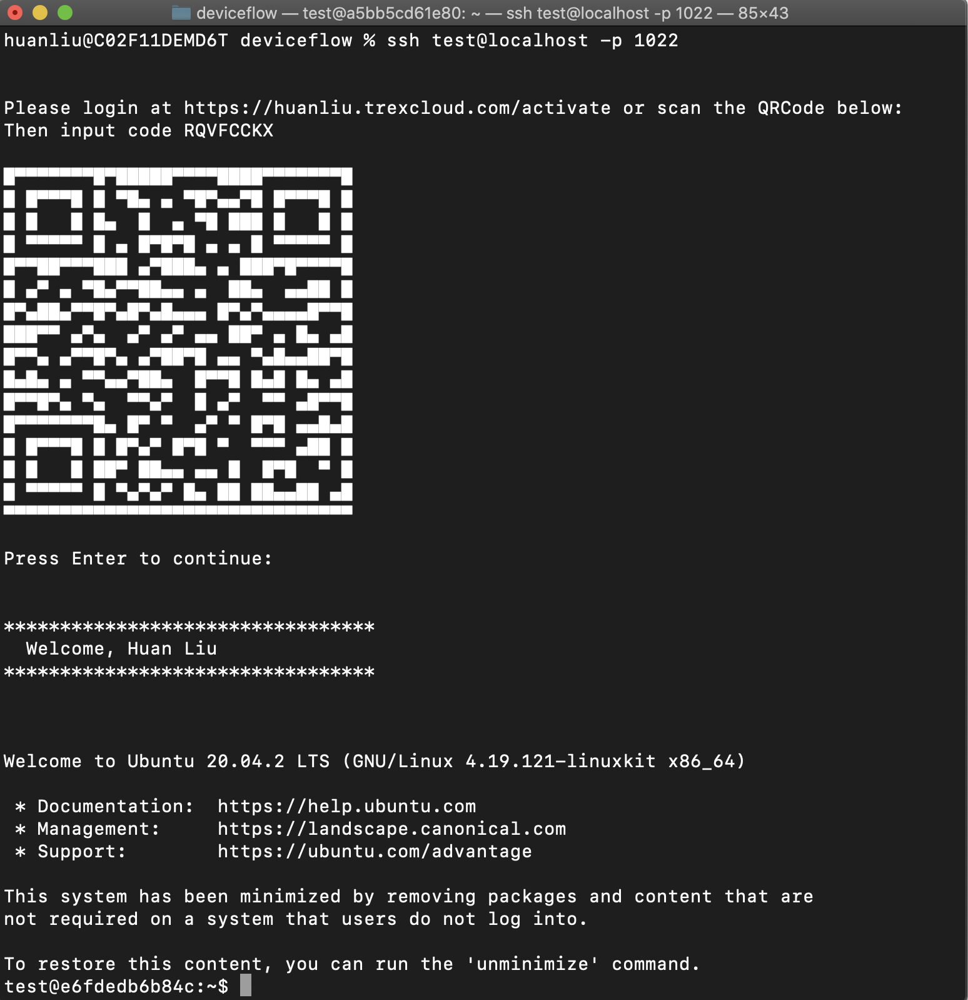

# DeviceFlowSSH

Change SSH login to use Okta Device Flow to authenticate instead of using the normal password. 

This is a pluggable PAM module. It is tested on Ubuntu 20.04.2 LTS, may need tweaking on other platforms. 

This login experience looks like the following screenshot:



## how to run

First we need to bypass the normal password authentication. In `/etc/pam.d/sshd`, find a line with `@include common-auth`, comment it out. Then, add `auth       required     deviceflow.so`, where deviceflow.so is a module that we will compile shortly. The file should look like this:

```
# @include common-auth    # Disable password authentication
auth       required     deviceflow.so   # Plug in our authentication module
```

Next, we need to make sure PAM modules are enabled. In `/etc/ssh/sshd_config`, we should change `ChallengeResponseAuthentication no` to `ChallengeResponseAuthentication yes`. Also, we need to make sure there is a line `UsePAM yes`. The file should look like this:

```
ChallengeResponseAuthentication yes
UsePAM yes
```

## Compile and install deviceflow.so

`deviceflow.so` is the PAM module that handles authentication with Okta's Device Flow capability. Check the tutorial to make sure you have enabled Device Flow grant type on your authentication server. To compile this module, you need a few packages, install these in Ubuntu:

```
apt install build-essential libpam0g-dev libcurl4-openssl-dev  libqrencode-dev -y
```

There are two source files. 
* `deviceflow.c`: This has all the logic to handle device flow and PAM interactions. 
* `qr.c`: This is used to generate ASCII QR code. It is borrowed from [here](https://github.com/Y2Z/qr) (changed main function to turn it into a function call). 

To compile:

```
gcc -fPIC -c deviceflow.c qr.c
sudo ld -x --shared -o /lib/security/deviceflow.so deviceflow.o qr.o -lm -lqrencode -lcurl
```

You need to restart sshd server for the change to take effect, e.g., `/etc/init.d/ssh restart` depending on your SSHD setup.

## Experiment with Docker

Instead of messing around on a Ubuntu server, you can also try out the flow in a Docker container. The Dockerfile is included. 

Build the docker image:

```
 docker build -t ubuntuwithdeviceflowssh .  
```
Run the docker image:

```
docker run -d -it -v ~/workspace/deviceflow/:/home/ubuntu -v ~/workspace/deviceflowsecurity/:/lib/security -p 1022:22  ubuntuwithdeviceflowssh
```

where `~/workspace/deviceflow` contains the source files (this repo) locally, and `~/workspace/deviceflowsecurity/` is a directory to hold the compiled `deviceflow.so` file. 

Then, you can login:

```
ssh test@localhost -p 1022
```
